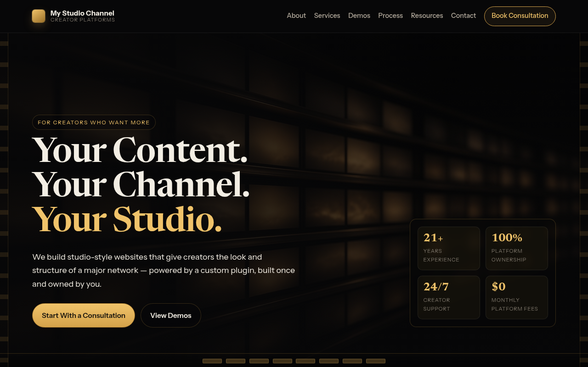

# MyStudioChannel-Ravyn

> **Your Content. Your Channel. Your Studio.** — Ravyn's own-twist rebuild of My Studio Channel's creator-platform site.

[](https://github.com/agentzlab/MyStudioChannel-Ravyn/actions/workflows/pages/pages-build-deployment)


**Live preview:** https://agentzlab.github.io/MyStudioChannel-Ravyn/

## Hero



## What's inside

Ravyn's independent rebuild of [mystudiochannel.com](https://mystudiochannel.com/) — Jon's "My Studio Channel" creator-platforms site. It sells studio-style websites for creators: "the look and structure of a major network — powered by a custom plugin, built once and owned by you."

This is the sister build to Trinity's `agentzlab/MyStudioChannel-Remake` — same real copy, Ravyn's own design twist. Key requirements from Jon: **full generated imagery throughout** (no flat placeholder blocks), real copy from the live site, phone-friendly, demo only.

## Design language

- Near-black grounds, warm gold/amber accents
- **Editorial film-strip / channel-grid** — stacked chapter bands and horizontal programming rows (not a centered broadcast hero)
- Big display type (Newsreader) with Instrument Sans UI
- Dark-mode first — no light theme planned
- Subtle footer badge: `Ravyn · MSC rebuild · 2026-09-26`
- Full imagery deck: unique art per demo card + section plates for Programming Styles and Own Your Platform

## Tech stack

| Layer | Choice |
|---|---|
| Markup | Static `index.html` + `styles.css` + `app.js` |
| Styling | Hand-written CSS, no framework |
| Hosting | GitHub Pages (this repo, `main`) |

The source site (`jonbeatz/MyStudioChannel`, private) is Next.js + Payload CMS. The rebuild is static — no CMS, no build step.

## Project structure

```
MyStudioChannel-Ravyn/
├── index.html
├── styles.css
├── app.js
├── assets/
│   ├── screenshot.png      # dark-mode hero shot (~1280×800)
│   └── img/                # generated section + demo plates
│       ├── hero-channel-grid.png
│       ├── about-studio.png
│       ├── own-platform.png
│       ├── packages-production.png
│       ├── programming-shelf.png
│       ├── demo-talkshow-land.png
│       ├── demo-xtronic.png
│       ├── demo-indie.png
│       ├── demo-podcast.png
│       ├── demo-everyway.png
│       ├── testimonials-warm.png
│       ├── process-timeline.png
│       └── cta-launch.png
├── docs/
│   └── reference.md
├── .nojekyll
└── README.md
```

## Workflow

Branch-based changes, no PRs unless Jon asks. Screenshots and the README hero stay current with every build change.
